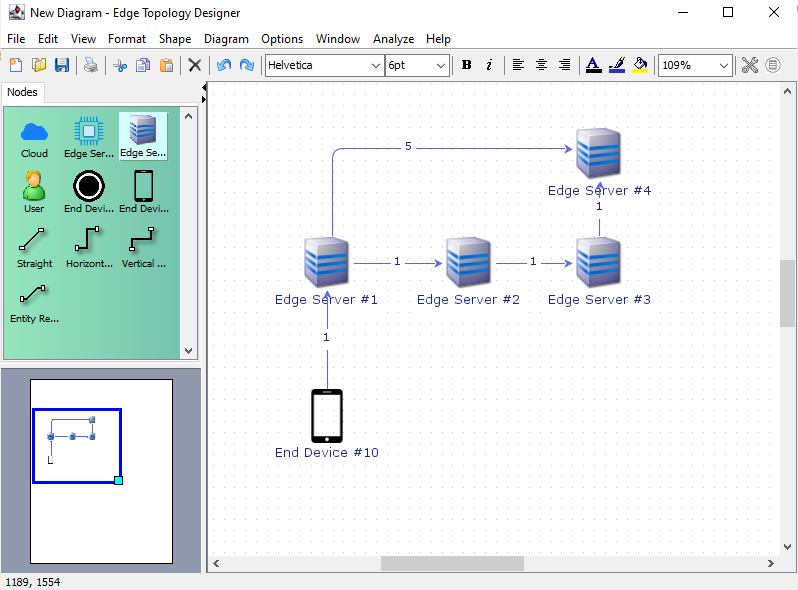

# Edge Topology Designer

Allows creation of topologies for RTEF [1]. The created ETD file is compatible with RTEF.
Based on [jGraphX](https://github.com/jgraph/jgraphx) library.

  

Get latest executable from [here](https://github.com/vgezer/edgeTopologyDesigner/releases/latest).

## Features:

 - Automatically assign unique ID for each node.
 - Drag and drop nodes to create links between them.
 - Drag and drop a node to create a new node based of the same type.
 - Analysis tool to measure the shortest distance between nodes.
 - Add notes, or free-text to visualise in the editor.
 - Save as PNG or as a plain topology format.
 - Print the topology.
 - Ability to set an automatic layout (Hierarchical, Stack, Circle, etc.) analysing connections.
 - Greate groups to define sub-topologies as subdiagrams.

See a 3-minute YouTube Video for major features:

	

## Execution

main method is in:

    com/mxgraph/app/designer/TopologyDesigner.java
	
## Plain Topology Format

    # Defining available Edge Servers
    ### Node, ID, Server Name, Optional Comment
    
    Node, 1, Edge Server 1, Server 1
    Node, 2, Edge Server 2, Server 2
    #### 192.168.1.3 is an example IP to reach Edge Server 3 and 83 is the Port that is listened by the RTEF
    Node, 3, Edge Server 3, @192.168.1.3:83
    
    # Defining available End Devices
    Node, 10, ED 1, End Device 1
    Node, 20, ED 2
    Node, 30, ED 3
    Node, 40, ED 4
    
    # Adding connections
    ### Connection, From Node ID, To Node ID, Latency, Opt. Comment
    
    ## Edge Server to Edge Server connections
    Connection, 1, 2, 1.0, My connection comment
    Connection, 2, 3, 1.0, This connection will be auto-established if AUTOCONNECT is true 
    
    ## End Device to Edge Server connections
    Connection, 10, 1, 1.0
    Connection, 20, 1, 1.0
    Connection, 30, 1, 1.0
    Connection, 40, 2, 1.0

## References
[1] Gezer, V and Ruskowski, M., *An Extensible Real-Time Capable Server Architecture for Edge Computing*, 
Sixth International Conference on Advances in Computing, Electronics and Communication - ACEC 2017, DOI: 
10.15224/978-1-63248-138-2-15
