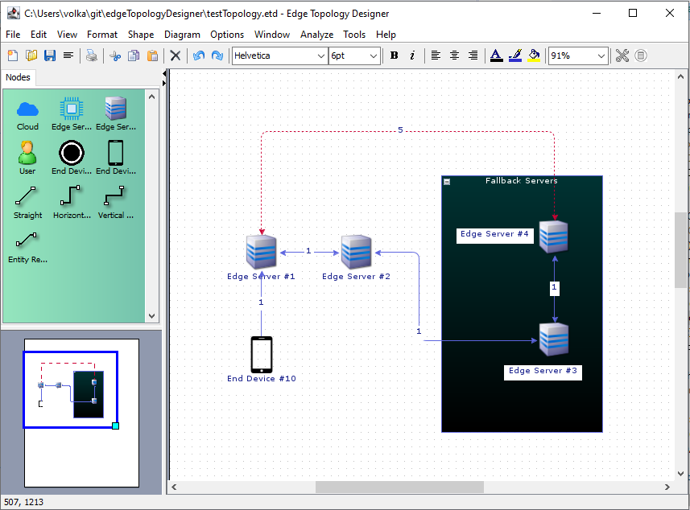

# Edge Topology Designer

Allows creation of topologies for RTEF [1]. The created ETD file is compatible with RTEF.
Based on [jGraphX](https://github.com/jgraph/jgraphx) library.

  

## Features:

 - Automatically assign unique ID for each node.
 - Drag and Drop nodes to create links between them.
 - Analysis tool to measure the shortest distance between nodes.
 - Add nodes, or free-text to visualise in the editor.
 - Save as PNG.
 - Print the topology.

## Execution

main method is in:

    com/mxgraph/app/designer/TopologyDesigner.java

## References
[1] Gezer, V and Ruskowski, M., *An Extensible Real-Time Capable Server Architecture for Edge Computing*, 
Sixth International Conference on Advances in Computing, Electronics and Communication - ACEC 2017, DOI: 
10.15224/978-1-63248-138-2-15